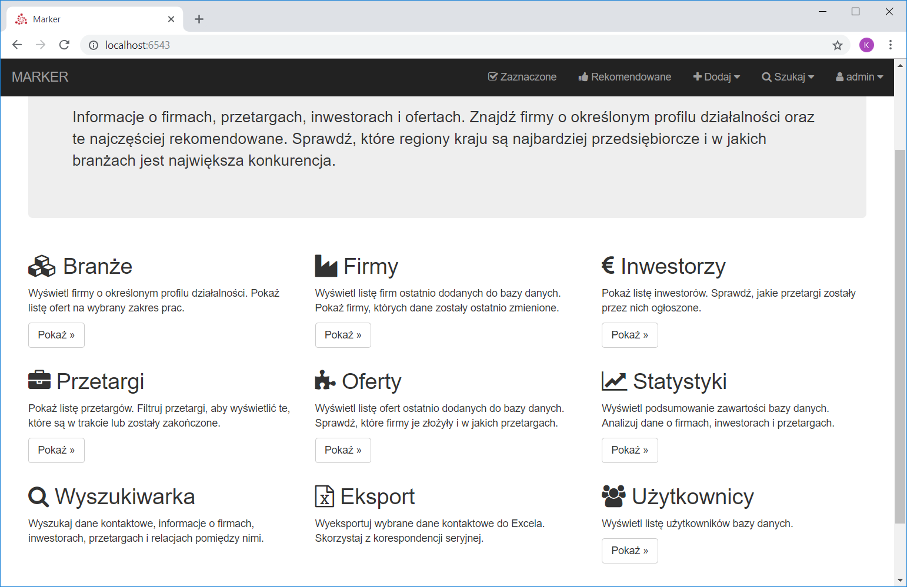

# Marker

Aplikacja dla Generalnych Wykonawców usprawniająca proces ofertowania i analizy rynku.

### Przeznaczenie

* Obsługa informacji o firmach, inwestorach, przetargach, ofertach oraz relacjach pomiędzy nimi
* Zwiększenie wydajności i skuteczności ofertowania
* Zmniejszenie progu wejścia dla nowych pracowników

### Co wyróżnia aplikację?

* Dane nie są wyłącznie zbiorem rekordów, lecz odzwierciedlają dotychczasową działalność
* Dostęp do danych mają tylko zalogowani użytkownicy zgodnie z uprawnieniami nadanymi przez administratora
* Eksportowanie danych kontaktowych do Excela w formie umożliwiającej skorzystanie z [korespondencji seryjnej](https://support.office.com/pl-pl/article/Tworzenie-korespondencji-seryjnej-za-pomoc%C4%85-arkusza-kalkulacyjnego-programu-Excel-858c7d7f-5cc0-4ba1-9a7b-0a948fa3d7d3)
* Podpowiadanie firm o podobnym profilu działalności do aktualnie wyświetlanej firmy

### Dlaczego Marker?

Nazwa Marker pochodzi od angielskiego czasownika *mark*. Jedną z podstawowych funkcjonalności aplikacji jest możliwość zaznaczania przez użytkowników rekomendowanych pozycji za pomocą przycisku 👍. Dzięki temu z gąszczu danych można w szybki sposób wybrać te najbardziej interesujące, np. firmy z wybranej branży posortowane wg liczby rekomendacji.

### Dlaczego nie Excel?

Do przedstawienia wyżej wymienionych relacji najlepszym rozwiązaniem jest relacyjna baza danych. Swoboda umieszczania danych w skoroszycie Excela oraz ich formatowania w dowolny sposób często skutkuje tym, że w krótkim czasie zasoby stają się nieczytelne i trudno wydobyć z nich interesujące informacje. Szczególnie jeśli arkusze uzupełniane są przez różne osoby.
Marker dba o to, aby wprowadzane dane były kompletne i poprawne, a dostęp do nich łatwy i szybki. Aplikacja przeprowadza walidację danych (m.in. adresów email, numerów NIP i REGON). Sprawdza czy wymagane pola zostały wypełnione oraz czy format danych jest prawidłowy. W razie potrzeby dokonuje korekty przed zapisem.

### Zrzuty ekranu

